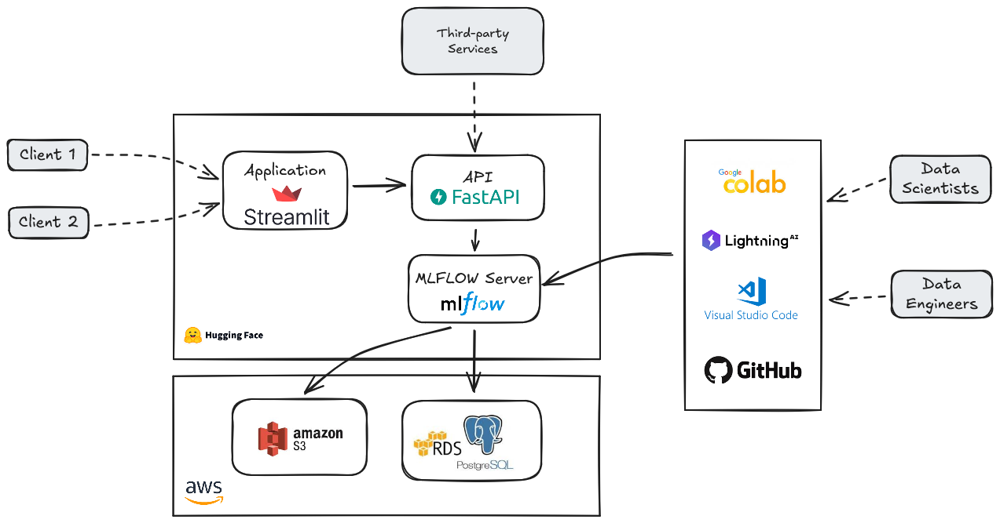

# Projet final Jedha

## Objectif

Notre objectif est de fournir une API et une application web qui permette de prédire la présence ou pas de pathologie sur des radios des poumons.

En cas de détection d'une pathologie, nos services sont capables de proposer la pathologie la plus probable avec un indice de confiance.

## Architecture du projet

L'architecture suivante a été utilisée pour la réalisation du projet :



Nous avons travaillé avec un serveur mlflow afin de maitriser les différents entrainements de différents modèles, de comparer les résultats et de choisir les modèles les plus adaptés.

Les données MLFLOW sont hébergées sur AWS via les services RDS et S3.

L'entrainement des modèles a été réalisé avec Google Collab Pay-as-you-go et Lightning AI Free Plan.

Nous avons souhaité utiliser une API afin d'isoler nos services de l'application web et de permettre une intégration à d'autres services tiers.

## Structure des dossiers

Les sources sont organisés de la manière suivante :
 - *root* :
   - *.gitignore* : configuratuion Git
   - *requirements.txt* : dépendances nécessaires à l'exécution du projet en local
   - *README.md* : documentation générale du projet 
 - *.vscode* : configuration de l'IDE Visual Studio Code
 - *api* : image Docker, dépendances de l'API, scripts d'exécution et documentation
   - *src* : sources de l'API
 - *app* : image Docker, dépendances de l'application, scripts d'exécution et documentation
   - *src* : sources de l'application
 - *artifacts* : liens vers les modèles de production
 - *infra* : élements d'infrastructure nécessaires au projet
   - *mlflow-server* : image Docker, dépendances du serveur mlflow et documentation
 - *models* : modèles sélectionnés et utilisés en production
   - *tests* : tests des modèles sélectionnés
   - *demo* : video and xray images for demo
 - *notebooks* : éléments d'explorations de données et de test d'éligibilité des modèles


## Environnement local

### Prérequis

- python 3.12.x

### Installation

Les commandes suivantes créent l'environnement virtuel, l'active et installe les dépendances listées dans le fichier requirements.txt.

Windows :

```Windows
python -m venv .venv
.\.venv\Scripts\Activate.ps1
pip install -r requirements.txt
```

Mac/Linux :

```Mac/Linux
python -m venv .venv
source .venv/bin/activate
pip install -r requirements.txt
```

### Ajout de dépendances

Vérifier que l'environnement virtuel est activé.

Les commandes suivantes installent les librairies dans l'environnement virtuel actif et ajoute celles-ci au fichier requirements.txt.

```
pip install #libraries_to_install#
pip freeze > requirements.txt
```

# Crédits

- [Eugénie Molodo](https://github.com/Eug-M)
- [Juliette Rodrigues](https://github.com/julietteRDC)
- [Sophie Laussel](https://github.com/lsophie12)
- [David Remond](https://github.com/davidremond)